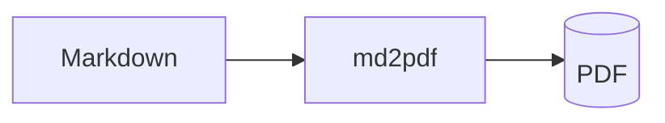

# md-to-pdf-cli

Convert local Markdown files to **PDF** using headless Chromium


## Install

Requires Python 3.12+.

```bash
# with uv (recommended): installs the `md2pdf` command, isolated
uv tool install md-to-pdf-cli
uv tool run --from md-to-pdf-cli playwright install chromium   # one-time browser download

# or with pip
pip install md-to-pdf-cli
playwright install chromium                                    # one-time browser download
```

Chromium is **not** a pip dependency — it's a browser binary Playwright downloads
once into a shared cache. If it's missing, `md2pdf` tells you the exact command to run.

## Quick start

```bash
md2pdf report.md                 # writes report.pdf next to the input
md2pdf report.md -o out/doc.pdf  # choose the output path
```

`md2pdf <file>` is shorthand for `md2pdf convert <file>`.

## Usage

```
md2pdf <input.md> [OPTIONS]
```

| Option | What it does |
|--------|--------------|
| `-o, --output PATH` | Output PDF path (default: same name as input). |
| `-c, --config PATH` | Use a specific `md2pdf.toml` (default: auto-load from current dir). |
| `--page-size NAME` | `A4`, `Letter`, `Legal`, … |
| `--margin SIZE` | Margin on all sides, e.g. `2cm`. |
| `--landscape / --portrait` | Page orientation. |
| `--css FILE` | Extra CSS file, applied after the theme (repeatable). |
| `--code-style NAME` | Pygments highlight style, e.g. `monokai`. |
| `--font STACK` | CSS `font-family` stack. |
| `--toc / --no-toc` | Generate a table of contents page. |
| `--math / --no-math` | LaTeX math rendering. |
| `--mermaid / --no-mermaid` | mermaid diagram rendering. |
| `--embed-images / --no-embed-images` | Inline local images as data URIs. |
| `--header HTML`, `--footer HTML` | Page header/footer (see [Headers & page numbers](#headers-footers--page-numbers)). |

Run `md2pdf --help` for the full list.

## What it renders, and how to use it

Write standard Markdown — these capabilities work out of the box.

### Code blocks

Fenced code blocks are highlighted server-side with Pygments. Just tag the language:

````markdown
```python
def greet(name): return f"Hello, {name}"
```
````

Pick the colour scheme with `--code-style monokai` (any Pygments style name).

### Math

Inline `$...$` and block `$$...$$` LaTeX are typeset with KaTeX:

```markdown
Euler's identity is $e^{i\pi} + 1 = 0$.

$$
\int_{-\infty}^{\infty} e^{-x^2}\,dx = \sqrt{\pi}
$$
```

### Diagrams

A ```` ```mermaid ```` fence is rendered to a vector diagram:

````markdown

````

### Tables

GFM tables are supported. Long tables that span pages are not sliced mid-row, and
the header row repeats at the top of each page.

### Images

Relative image paths are resolved against the **Markdown file's** location, so
`` works regardless of where you run the command. Remote
`http(s)` images are fetched at render time. Use `--embed-images` to inline local
images into a fully self-contained PDF.

### Chinese / CJK

CJK text renders correctly (UTF-8 with BOM handling and a CJK-first font stack).
On Linux, install CJK fonts first — see [Troubleshooting](#troubleshooting).

### Table of contents & bookmarks

`--toc` adds a contents page built from your headings. The PDF also gets an
outline (bookmarks) from the heading structure automatically.

### Headers, footers & page numbers

Enabled via the config file (below). Templates may use Chromium's placeholders:
`pageNumber`, `totalPages`, `title`, `date`, `url`. A centered "page / total"
footer is on by default.

## Configuration

Scaffold a config and a starter theme:

```bash
md2pdf init        # writes md2pdf.toml and theme.css
```

`md2pdf` auto-loads `md2pdf.toml` from the current directory. Precedence:
**CLI flags > config file > defaults.**

```toml
[output]
page_size = "A4"
margin = { top = "2cm", bottom = "2cm", left = "1.8cm", right = "1.8cm" }

[theme]
css = ["theme.css"]              # extra CSS, applied after the default theme
code_style = "default"           # any Pygments style
# font_family = '"Noto Sans CJK TC", "Microsoft JhengHei", sans-serif'

[features]
math = true
mermaid = true
toc = false
embed_images = false

[footer]
enabled = true
template = '<span class="pageNumber"></span> / <span class="totalPages"></span>'

[header]
enabled = false
template = '<span class="title"></span>'
```

Custom styling: anything in your `theme.css` (or `--css`) overrides the built-in
theme, including the `--md2pdf-*` CSS variables it defines.

## How it works

```
.md ──▶ markdown-it-py (+ Pygments, dollarmath) ──▶ self-contained HTML
     ──▶ Chromium (KaTeX + mermaid render, fonts load) ──▶ page.pdf() ──▶ .pdf
```

All assets (theme CSS, Pygments CSS, KaTeX with fonts, mermaid) are inlined into
the HTML, so conversion is offline and reproducible. md2pdf waits for math and
diagrams to finish rendering before printing, so nothing comes out half-drawn.

## Troubleshooting

- **`Chromium is not installed for Playwright`** — run `playwright install chromium`
  (or `uv tool run --from md-to-pdf-cli playwright install chromium` for a uv-tool install).
- **Chinese/CJK text shows as boxes (tofu) on Linux** — install CJK fonts, e.g.
  `sudo apt install fonts-noto-cjk` on Debian/Ubuntu. Windows and macOS already
  ship with CJK fonts.
- **Chromium fails to launch on a headless Linux server** — install its system
  libraries: `playwright install-deps chromium` (needs root).

## Development

```bash
uv sync
uv run playwright install chromium
uv run pytest                 # full suite (the end-to-end test launches Chromium)
uv run pytest -m "not slow"   # skip the browser-based test
uv run ruff check . && uv run ruff format --check .
```

## License

MIT
