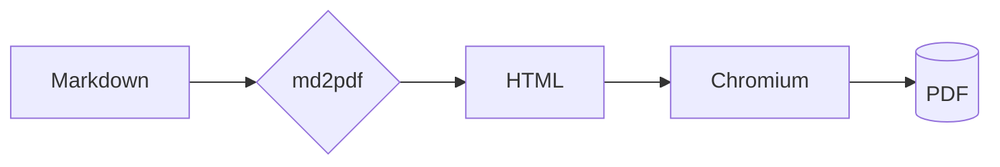

# md2pdf 範例文件

這是一份用來驗證 **md2pdf** 各項功能的範例，特別是中文編碼、表格跨頁、圖片嵌入、
程式碼高亮、數學公式與 mermaid 圖表。

## 中文與排版

繁體中文、简体中文、標點符號：「引號」、《書名號》、破折號——以及英文 mixed text 123。
行內數學 $E = mc^2$ 應該正確排版。

## 圖片

本地相對路徑圖片（測試破圖修復）：


## 程式碼高亮

```python
def greet(name: str) -> str:
    """打招呼。"""
    return f"你好, {name}!"


print(greet("世界"))
```

## 數學公式

行內：質能等價 $E = mc^2$。

區塊公式：

$$
\int_{-\infty}^{\infty} e^{-x^2}\,dx = \sqrt{\pi}
$$

## mermaid 流程圖



## 長表格（測試跨頁不截斷、表頭重複）

| 編號 | 名稱 | 說明 | 數值 |
|-----:|------|------|-----:|
| 1 | 項目一 | 這是一段用來撐高表格的中文說明文字 | 100 |
| 2 | 項目二 | 這是一段用來撐高表格的中文說明文字 | 200 |
| 3 | 項目三 | 這是一段用來撐高表格的中文說明文字 | 300 |
| 4 | 項目四 | 這是一段用來撐高表格的中文說明文字 | 400 |
| 5 | 項目五 | 這是一段用來撐高表格的中文說明文字 | 500 |
| 6 | 項目六 | 這是一段用來撐高表格的中文說明文字 | 600 |
| 7 | 項目七 | 這是一段用來撐高表格的中文說明文字 | 700 |
| 8 | 項目八 | 這是一段用來撐高表格的中文說明文字 | 800 |
| 9 | 項目九 | 這是一段用來撐高表格的中文說明文字 | 900 |
| 10 | 項目十 | 這是一段用來撐高表格的中文說明文字 | 1000 |
| 11 | 項目十一 | 這是一段用來撐高表格的中文說明文字 | 1100 |
| 12 | 項目十二 | 這是一段用來撐高表格的中文說明文字 | 1200 |
| 13 | 項目十三 | 這是一段用來撐高表格的中文說明文字 | 1300 |
| 14 | 項目十四 | 這是一段用來撐高表格的中文說明文字 | 1400 |
| 15 | 項目十五 | 這是一段用來撐高表格的中文說明文字 | 1500 |

## 清單與引用

- [x] 已完成項目
- [ ] 待辦項目

> 引用區塊：保真度優先，preview 與輸出一致。

腳註示範[^1]。

[^1]: 這是一個腳註。
